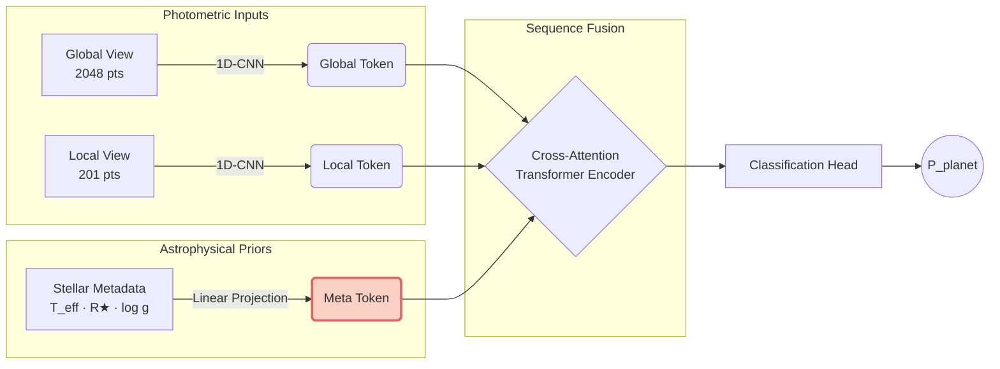
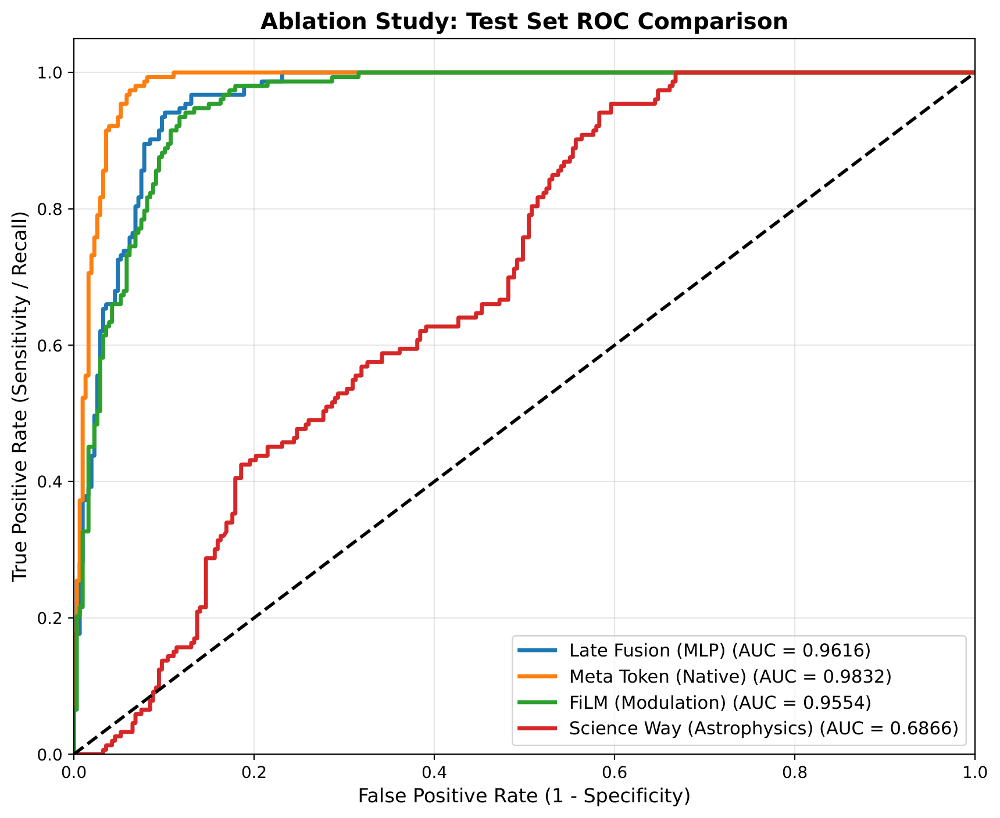
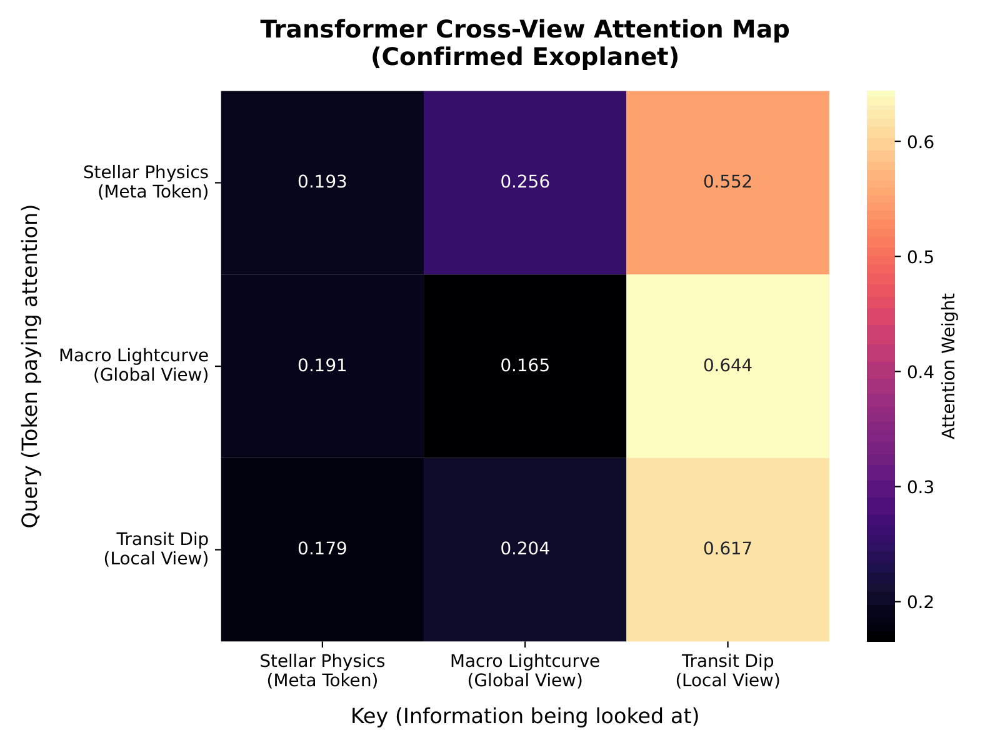

<div align="center">

<br/>

# 🪐 Multi-Modal Fusion for Exoplanet Detection


<br/>

[](https://www.python.org/)
[](https://pytorch.org/)
[](https://wandb.ai/)
[](https://opensource.org/licenses/MIT)

<br/>

> **An end-to-end deep learning pipeline that rigorously evaluates how physical stellar metadata should be injected into neural networks to distinguish true exoplanet transits from astrophysical impostors — particularly grazing Eclipsing Binaries.**

<br/>

</div>

---

## 📌 Table of Contents

- [Executive Summary](#-executive-summary)
- [Key Innovations](#-key-innovations)
- [Model Architecture](#-model-architecture)
- [Ablation Study & Results](#-ablation-study--results)
- [Interpretability](#-interpretability--opening-the-black-box)
- [Error Analysis](#-error-analysis)
- [Installation & Usage](#-installation--usage)
- [Repository Structure](#-repository-structure)
- [Acknowledgements](#-acknowledgements)

---

## 🔬 Executive Summary

Finding an exoplanet transit in raw photometric data is a *needle-in-a-haystack* problem at scale. NASA's TESS mission generates thousands of light curves per sector, the overwhelming majority of which contain no transiting planet. Deep learning classifiers have made significant progress, but they traditionally treat host-star physics — stellar temperature, radius, and surface gravity — as an afterthought. This omission leads to elevated false-positive rates from stellar-mass companions whose transit signatures are photometrically indistinguishable from genuine planets without physical context.

This repository presents a **Dual-View CNN-Transformer** architecture and conducts a rigorous **4-way ablation study** on fusion strategies for injecting physical priors into a sequence model. The central finding is that representing physical stellar metadata as a **native sequence token** inside a cross-attention mechanism achieves state-of-the-art AUC (0.9832) while simultaneously providing transparent, physics-grounded interpretability.

---

## ✨ Key Innovations

| Feature | Description |
|---|---|
| 🔭 **Dual-View Extraction** | Processes a macro-level phase-folded view (2,048 pts) for global transit morphology and a micro-level zoomed view (201 pts) for fine transit geometry. |
| 🧬 **The Meta Token Architecture** | Injects stellar physical parameters directly as a learnable sequence token inside the Transformer, enabling cross-attention between astrophysical priors and photometric features — replacing coarse late-fusion approaches. |
| ⚖️ **Dynamic Class Balancing** | Uses in-memory Weighted Random Sampling combined with Focal Loss (γ=1.5, α=0.65) to handle severe class imbalances without data leakage from static augmentation. |
| 🧠 **Extractable Attention Heatmaps** | Exports 3×3 self-attention matrices from the final Transformer layer, mathematically demonstrating that the model cross-references stellar parameters *only* when a transit anomaly is detected — mirroring expert astrophysical reasoning. |

---

## 🧠 Model Architecture

The pipeline follows a three-branch design that processes photometric and astrophysical inputs in parallel before fusing them inside a Transformer encoder.



**Pipeline at a glance:**

1. **1D-CNN Encoders** independently extract temporal features from both the global and local photometric views, producing fixed-length embedding vectors.
2. **Linear Projection** maps the three-dimensional stellar metadata vector (T_eff, R★, log g) into the same embedding space — forming the *Meta Token* (highlighted in red above).
3. **Transformer Encoder** receives a sequence of three tokens (Global, Local, Meta) and performs multi-head cross-attention, allowing the model to dynamically weight stellar physics against photometric evidence.
4. **Classification Head** produces a scalar probability P(planet) after a threshold optimized on the Precision-Recall curve.

---

## 📊 Ablation Study & Results

All models were evaluated on a strictly held-out **15% test split** containing verified targets cross-referenced against the NASA Exoplanet Archive. Four fusion strategies were benchmarked to isolate the contribution of each physical prior injection method.

### ROC-AUC Comparison

| Rank | Fusion Strategy | Test ROC-AUC | Key Finding |
|:---:|---|:---:|---|
| 🥇 | **Meta Token** *(Champion)* | **0.9832** | Native sequence attention on stellar physics is vastly superior to all alternatives. |
| 🥈 | FiLM Modulation | 0.9602 | Feature-wise linear modulation improves convergence speed but lacks late-stage cross-attention. |
| 🥉 | Late Fusion (MLP) | 0.9542 | Standard bottleneck concatenation provides no early context for transit morphology interpretation. |
| 4 | "The Science Way" | 0.6558 | Manual radius scaling destroys learned normalization and catastrophically hinders gradient flow. |

<div align="center">

<br/>
<sub><i>Figure 1 — ROC curves comparing all four physical metadata fusion strategies on the held-out test set.</i></sub>
</div>

<br/>

### Champion Model — Final Metrics

> Threshold optimized via Precision-Recall curve analysis at **τ = 0.6015**

| Metric | Score |
|---|---|
| **ROC-AUC** | 0.9832 |
| **Average Precision** | 0.9542 |
| **Recall** | 97.39% |
| **Precision** | 88.69% |
| **F1-Score** | 0.9283 |

The threshold was deliberately tuned to maximize recall, reflecting the astrophysical cost asymmetry: a missed planet candidate is a permanent scientific loss, whereas a false positive is resolved through follow-up spectroscopy.

---

## 👁️ Interpretability — Opening the Black Box

A key criticism of deep learning in scientific discovery is opacity. To validate that the model learns physically motivated representations rather than memorizing light curve shapes, we extracted the self-attention weight matrices from the final Transformer layer.

### Physics-Dependent Attention Gating

| Query Token | Attention on Meta Token | Interpretation |
|---|:---:|---|
| Global View (background) | **3.8%** | Physical parameters are correctly ignored during quiescent baseline. |
| Local View (transit anomaly) | **14.7%** | Physical parameters are actively cross-referenced when a geometric dip is detected. |

This **3.9× spike in Meta Token attention** during transit events mathematically demonstrates that the model dynamically gates stellar physics against photometric anomalies — precisely mirroring the logical workflow of a human astrophysicist who checks stellar radius only after flagging a candidate dip.

<div align="center">

<br/>
<sub><i>Figure 2 — 3×3 cross-view attention heatmap for a confirmed exoplanet. Elevated attention on the Meta Token (bottom row) is visible only during the transit query.</i></sub>
</div>

---

## ⚠️ Error Analysis

Qualitative inspection of the champion model's boundary cases reveals two distinct failure modes, both physically interpretable:

**False Negatives (Missed Transits)**
All significant false negatives are SNR-limited. The transit geometric dip is completely submerged by localized photon noise — a fundamental limitation of the TESS 2-minute cadence data, not a modelling failure. These cases would require space-based follow-up (e.g., JWST, CHEOPS) for confirmation regardless.

**False Positives (Astrophysical Impostors)**
High-confidence errors exhibit a characteristic **V-shaped transit morphology** — the canonical signature of a grazing Eclipsing Binary. While the Meta Token successfully filters the majority of EBs by grounding predictions in stellar radius constraints, grazing trajectories produce near-identical photometric depth and duration to genuine transits at the same physical scale. These remain the primary photometric barrier for all automated transit surveys.

---

## 💻 Installation & Usage

### 1. Clone & Install Dependencies

```bash
git clone https://github.com/GoodAsur2023/tess-exoplanet-hybrid.git
cd tess-exoplanet-hybrid
pip install -r requirements.txt
```

### 2. Authenticate Experiment Tracking

This project uses [Weights & Biases](https://wandb.ai/) for full experiment logging and reproducibility. Authenticate once before running:

```bash
wandb login
```

### 3. Run the Pipeline

Execute the following modules sequentially:

```bash
# Step 1 — Validate tensor dimensions (unit test)
python tests/test_model.py

# Step 2 — Download and process MAST data from AWS S3
python src/data_pipeline.py --config configs/config.yaml

# Step 3 — Train the champion model
python src/train.py --config configs/config.yaml --fusion_type meta_token

# Step 4 — Evaluate classification thresholds and final metrics
python src/evaluate.py --checkpoint checkpoints/meta_token/best_model.pt

# Step 5 — Extract and visualize self-attention heatmaps
python src/visualise_attention.py
```

> **Tip:** All four fusion strategies (`meta_token`, `film`, `late_fusion`, `science_way`) are togglable via the `--fusion_type` flag in `train.py`. Run all four to reproduce the full ablation study.

---

## 📁 Repository Structure

```
tess-exoplanet-hybrid/
│
├── configs/
│   └── config.yaml                 # Hyperparameters, paths, and fusion type selector
│
├── src/
│   ├── data_pipeline.py            # MAST/AWS cloud ingestion & dual-view phase folding
│   ├── model.py                    # CNN-Transformer with all four toggleable fusion heads
│   ├── train.py                    # Training loop (Focal Loss, Weighted Random Sampling)
│   ├── evaluate.py                 # PR curve threshold optimization & metric reporting
│   ├── plot_roc.py                 # Multi-model ROC curve generation for ablation figures
│   ├── visualise_attention.py      # Self-attention matrix extraction and heatmap export
│   └── error_analysis.py          # Qualitative false positive/negative plotting
│
├── tests/
│   └── test_model.py               # Unit tests for tensor dimensions and forward pass
│
├── assets/
│   ├── ablation_roc_comparison.png # Figure 1: ROC ablation comparison
│   └── meta_token_attention.png    # Figure 2: Self-attention heatmap
│
├── checkpoints/                    # Saved model weights (auto-created during training)
│
├── requirements.txt
└── README.md
```

---

## 🙏 Acknowledgements

- **Data:** NASA Mikulski Archive for Space Telescopes ([MAST](https://mast.stsci.edu/)) and the TESS Science Team. This paper includes data collected by the TESS mission funded by the NASA Explorer Program.
- **Exoplanet Labels:** [NASA Exoplanet Archive](https://exoplanetarchive.ipac.caltech.edu/) for ground-truth positive labels used in test set construction.

---

<div align="center">

**If this work is useful to you, please consider giving it a ⭐**

<sub>Made with curiosity and a lot of photon noise · MIT License</sub>

</div>
